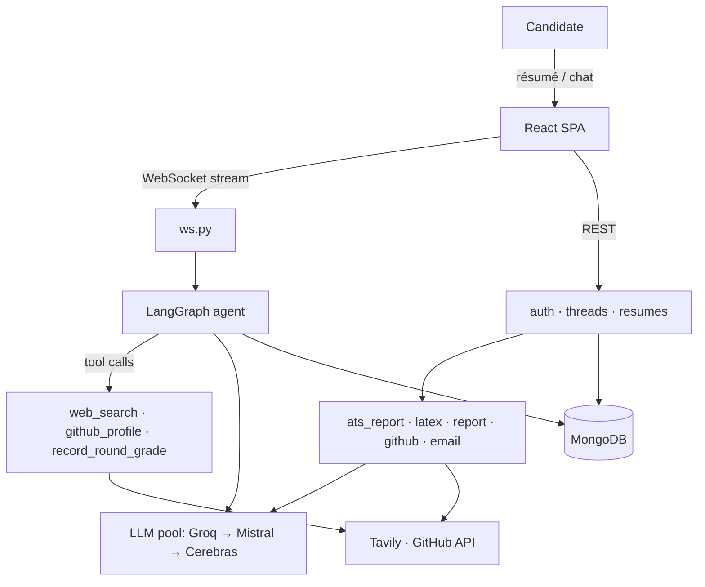
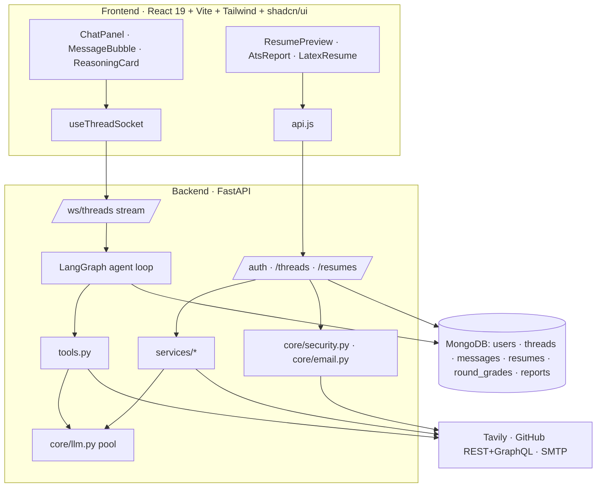
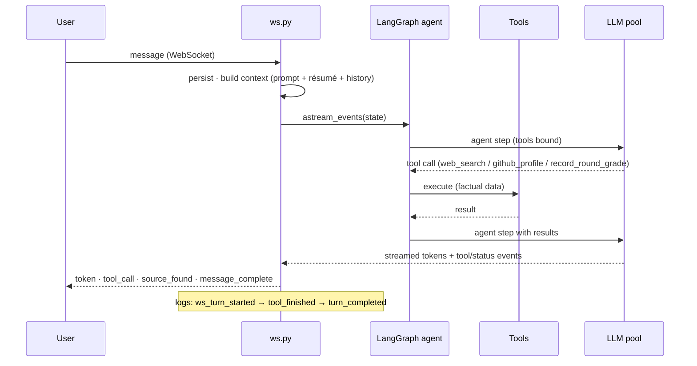

<div align="center">

# ⚡ Caliber

### Your AI Interview & Resume Coach — grounded in your real data, never generic

Caliber is a full-stack, **agentic** career copilot. Upload your résumé and it runs an **ATS-grounded review**, audits your **GitHub like a recruiter**, runs **adaptive mock interviews**, and answers career questions with **live web search** — all streamed in real time and grounded in *your* actual data (no fabrication).


</div>

---

## Table of contents
1. [Problem & understanding](#1-problem--understanding)
2. [What Caliber does](#2-what-caliber-does)
3. [System overview](#3-system-overview)
4. [Architecture deep dive](#4-architecture-deep-dive)
5. [Pipeline flows (sequence diagrams)](#5-pipeline-flows)
6. [AI choices & trade-offs](#6-ai-choices--trade-offs)
7. [Data model](#7-data-model)
8. [Tech stack](#8-tech-stack)
9. [Repository layout](#9-repository-layout)
10. [Setup & run](#10-setup--run)
11. [Environment variables](#11-environment-variables)
12. [Testing & verification](#12-testing--verification)
13. [Security, reliability & cost](#13-security-reliability--cost)
14. [Limitations & roadmap](#14-limitations--roadmap)

---

## 1) Problem & understanding

Job seekers get **generic** advice. Resume tools hand out the same templated "add a README, quantify impact" checklist to everyone; interview prep doesn't adapt; and most AI tools happily **fabricate** facts about a candidate they've never actually looked at.

Caliber is built on one principle — **grounding over hype**. Every statement traces back to a real source:

- **The résumé** the candidate uploaded (text *and* hyperlinks).
- **The GitHub API** (factual repos, commits, stars, streak — never invented).
- **A cited web result** (Tavily) when current facts are needed.

If the data isn't available, Caliber says so instead of guessing. That single constraint shapes every design decision below.

---

## 2) What Caliber does

| Feature | What the candidate gets |
| --- | --- |
| 📄 **ATS Resume Review** | A 0–100 ATS score for a target role, missing keywords, concrete weaknesses, and **rewritten bullets** — extracted from the *real* résumé text — plus a one-click **LaTeX resume → Overleaf** export. |
| 🌿 **GitHub Profile Review** | A recruiter-style audit of the candidate's **actual** public repos: activity/streak, README & description gaps, top repos, languages. Numbers come from the GitHub API; the LLM only writes the prose. |
| 🎤 **Adaptive Mock Interviews** | Questions that adapt to the candidate's level, graded turn-by-turn, with a post-interview report. |
| 🔎 **Live Web Search** | When a question needs current facts, the agent calls Tavily and cites real sources — it never makes things up. |
| 🧠 **Single agentic chat** | One streaming chat that reads intent each turn and picks the right tool, with a live **"Reasoning" card** (what it searched, sources found, latency). |

---

## 3) System overview



Key modules:
- `app/api/ws.py` — WebSocket chat: builds context, runs the agent, streams tokens + tool events.
- `app/agent/graph.py` — the LangGraph loop (`agent → tools → agent`).
- `app/agent/tools.py` — the agent's tools (`web_search`, `github_profile`, `record_round_grade`).
- `app/services/*` — résumé/ATS/LaTeX/report/GitHub/email logic (REST side).
- `app/core/llm.py` — the provider fallback chain.

---

## 4) Architecture deep dive



Design highlights:
- **One agent, many modes.** Instead of hardcoded round logic, a single LangGraph tool-loop reads intent each turn — interview, teach, resume coach, or general — and calls tools as needed.
- **Factual vs. generated split.** Tool outputs (GitHub stats, web results) are *facts*; the LLM only writes prose around them, so it can't invent numbers.
- **Streaming-first.** The WebSocket emits `token`, `tool_call`, `source_found`, and `message_complete` events; the UI renders a live activity card.
- **Graceful degradation.** Missing API key / provider down / no email config — each path logs and falls back instead of crashing.

---

## 5) Pipeline flows

### A chat turn (streaming, tool-calling)


### Résumé → ATS report (+ GitHub developer profile)
```
Upload PDF/DOCX ─▶ extract text *and hyperlink URLs* (GitHub/LinkedIn captured)
                ─▶ /resumes/{id}/ats-report?role=...
                ─▶ resolve role · fetch GitHub (github_service) · LLM analysis (json_repair, timeout)
                ─▶ { atsScore, missingKeywords, weaknesses, improvedBullets, developerProfile }  (cached)
                ─▶ /resumes/{id}/latex ─▶ LaTeX resume ─▶ Overleaf
```

### Auth & password reset
```
signup / login  ─▶ JWT (HS256, env-configurable expiry) ─▶ session restored on refresh (logout only on 401)
forgot-password ─▶ hashed single-use token (TTL) ─▶ SMTP email ─▶ /?reset=<token> ─▶ reset-password
```

---

## 6) AI choices & trade-offs

| Decision | Why |
| --- | --- |
| **LangGraph single tool-loop** (not hardcoded flows) | The model decides when to search / fetch GitHub / grade — adapts to any request without branchy code. |
| **Provider fallback chain** (Groq → Mistral → Cerebras) | Resilience to rate limits / outages; tools are bound *before* `with_fallbacks` so tool-calling survives a failover. |
| **`content_and_artifact` for `web_search`** | The model reads clean text; the UI reads structured sources from the artifact — sources are shown without the model re-emitting them (and can't be hallucinated). |
| **Facts from the API, prose from the LLM** | `github_profile` returns real repos/commits/streak; the prompt forbids inventing them. Eliminates the "made-up repo name" failure mode. |
| **`json_repair` + output validation** | LLMs occasionally emit slightly-off JSON/LaTeX; we repair and validate (e.g. LaTeX must contain `\documentclass`) instead of 500-ing. |
| **Timeouts + caching on report calls** | Bounds latency/cost; cached ATS reports with an explicit **Regenerate** to refresh. |
| **Strict grounding prompt** | No fabricated résumé facts, scores, repos, or commits — say "not available" instead. |

---

## 7) Data model

MongoDB, every document user-scoped:

| Collection | Purpose |
| --- | --- |
| `users` | account + bcrypt password hash; hashed reset token (TTL) |
| `threads` | conversations (resume_ids, running summary, counters) |
| `messages` | chat history per thread |
| `resumes` | extracted text (+ hyperlinks), original file (b64), cached `ats_report` / skills |
| `round_grades` | per-question interview grades (written by `record_round_grade`) |
| `reports` | generated interview reports |

---

## 8) Tech stack

| Layer | Tech |
| --- | --- |
| **Backend** | FastAPI · LangGraph · LangChain · MongoDB (PyMongo) · structlog · PyMuPDF · python-docx · tiktoken · PyJWT · bcrypt |
| **LLMs** | Groq (`llama-3.3-70b-versatile`) → Mistral → Cerebras (auto-fallback) |
| **Agent tools** | `web_search` (Tavily) · `github_profile` (GitHub REST + GraphQL) · `record_round_grade` |
| **Frontend** | React 19 · Vite · Tailwind · shadcn/ui · Zustand · react-markdown · framer-motion · sonner |
| **Realtime** | WebSocket token streaming, reconnect-aware |

---

## 9) Repository layout

```
Interview_Bot/
├── backend/app/
│   ├── main.py            # FastAPI app, CORS, routers
│   ├── api/               # auth, ws (chat stream), threads, resumes
│   ├── agent/             # graph.py, state.py, tools.py
│   ├── core/              # llm, config, security, logging, email, context
│   ├── services/          # ats_report, latex_generator, report, github_service, scoring
│   ├── db/                # client.py, repositories.py
│   ├── prompts/           # agent.md (system prompt), interviewer.md
│   └── models/            # pydantic schemas
└── frontend/src/
    ├── App.jsx
    ├── components/        # Auth, LandingPage
    │   └── chat/          # ChatPanel, MessageBubble, Composer, Sidebar, TopBar,
    │                      # ResumePreview, AtsReport, LatexResume, ReasoningCard,
    │                      # SourceRow, CopyButton
    ├── store/chatStore.js
    └── lib/               # services/api.js, hooks/useThreadSocket.js
```

---

## 10) Setup & run

**Prerequisites:** Python 3.12 · Node 18+ · a MongoDB URI · at least one LLM key (Groq recommended).

```bash
# Backend
cd backend
python3.12 -m venv venv && source venv/bin/activate
pip install -r requirements.txt
cp .env.example .env          # fill in the values (see §11)
python -m app.main            # http://localhost:8000

# Frontend (new terminal)
cd frontend
npm install
npm run dev                   # http://localhost:3000
```

Open **http://localhost:3000**, create an account, upload a résumé.

---

## 11) Environment variables (`backend/.env`)

**Required:** `MONGODB_URI`, `MONGODB_DB`, `JWT_SECRET`, and at least one of `GROQ_API_KEY` / `MISTRAL_API` / `CEREBRAS_API`.

**Optional (features degrade gracefully):**

| Var | Default | Enables |
| --- | --- | --- |
| `TAVILY_API_KEY` | — | `web_search` tool |
| `GITHUB_TOKEN` | — | GitHub streak + 5000/hr rate limit |
| `SMTP_HOST/PORT/USER/PASS`, `FROM_EMAIL` | port `587` | password-reset emails (Gmail → App Password) |
| `FRONTEND_URL` | `localhost:3000` | base URL in reset links |
| `CORS_ORIGINS` | localhost:3000/5173 | allowed origins (comma-separated) |
| `JWT_EXPIRE_DAYS` / `RESET_TOKEN_TTL_MIN` | `30` / `30` | session & reset-token lifetimes |
| `GROQ_MODEL` / `MISTRAL_MODEL` / `CEREBRAS_MODEL` | sensible | per-provider model override |
| `AUTH_DEV_LOG_RESET_LINK` | `false` | **dev only** — print reset link to stdout when no SMTP |

---

## 12) Testing & verification

- **Backend** imports clean (no SyntaxWarnings); **frontend** `vite build` passes.
- End-to-end checks with real LLM / GitHub / DB calls: ATS report, LaTeX generation, skill extraction, `github_profile` (real repos), and the full **forgot/reset password** flow (valid token resets, single-use, expiry, no enumeration).
- PDF hyperlink extraction verified on a real résumé (GitHub/LinkedIn/LeetCode captured).
- Structured streaming logs per turn (`ws_turn_started → tool_finished → turn_completed`) mirrored to `logs.txt`.

---

## 13) Security, reliability & cost

- **Auth:** bcrypt password hashing; JWT (HS256, env-configurable expiry); every DB query scoped to the user; soft-deletes respected.
- **Password reset:** tokens are SHA-256-hashed, single-use, TTL-bound, and **never logged**; `forgot-password` returns a generic message (no email enumeration).
- **CORS:** explicit env-driven allow-list (no `*`-with-credentials).
- **Secrets:** `.env` and `logs.txt` are gitignored; no credentials in logs.
- **Reliability:** provider fallback chain; timeouts on report LLM calls; graceful no-op when an optional integration is unconfigured.
- **Cost:** ATS reports are cached (regenerate on demand); résumé text is truncated to a configured cap before prompting.

---

## 14) Limitations & roadmap

- **Private/org GitHub repos** aren't visible to a server token — needs a "Connect GitHub" OAuth flow (planned).
- **Password-reset email** requires SMTP credentials; without them the link only logs in dev.
- **LinkedIn/LeetCode** review is not implemented (LinkedIn has no viable public API; LeetCode would use its unofficial GraphQL).
- Two ATS surfaces exist (inline chat estimate vs. the structured `/ats-report` panel) — unifying on the panel as the single source of truth is planned.

---

<div align="center">
Built with FastAPI · LangGraph · React. <br/>
<sub>An AI coach that tells you what recruiters actually see.</sub>
</div>
